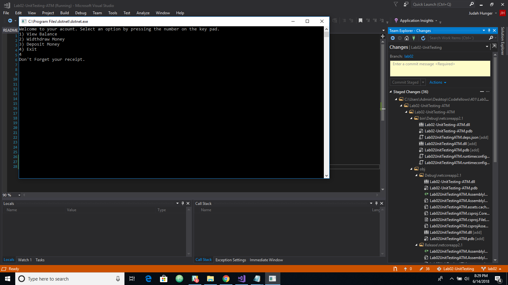

# Lab 02: Unit Testing
**Author**: Judah Hunger
**Version**: 1.0.1

## Overview
- This app represents an ATM 
- You select from the menu what you would like to do.
- Check your balance, withdraw from balance and deposit money into balance.

## Getting Started
- The following is required to run the program.
- 1. Visual Studio 2017 
- 2. The .NET desktop development workload enabled
- 3. No External NuGet packages are required for this application. 

## Example

## Architecture
- This application is created using ASP.NET Core 7.0 Console applicaitons. 
- Language: C# 
- Type of Applicaiton: Console Application 

## Change Log

- 06-14-2018 8:00pm - Added update to README.md.
- 06-14-2018 8:14pm - Added try and catch to methods and finally to main, so that user knows to grabs receipt.
- 06-14-2018 8:30pm - added comments to methods.